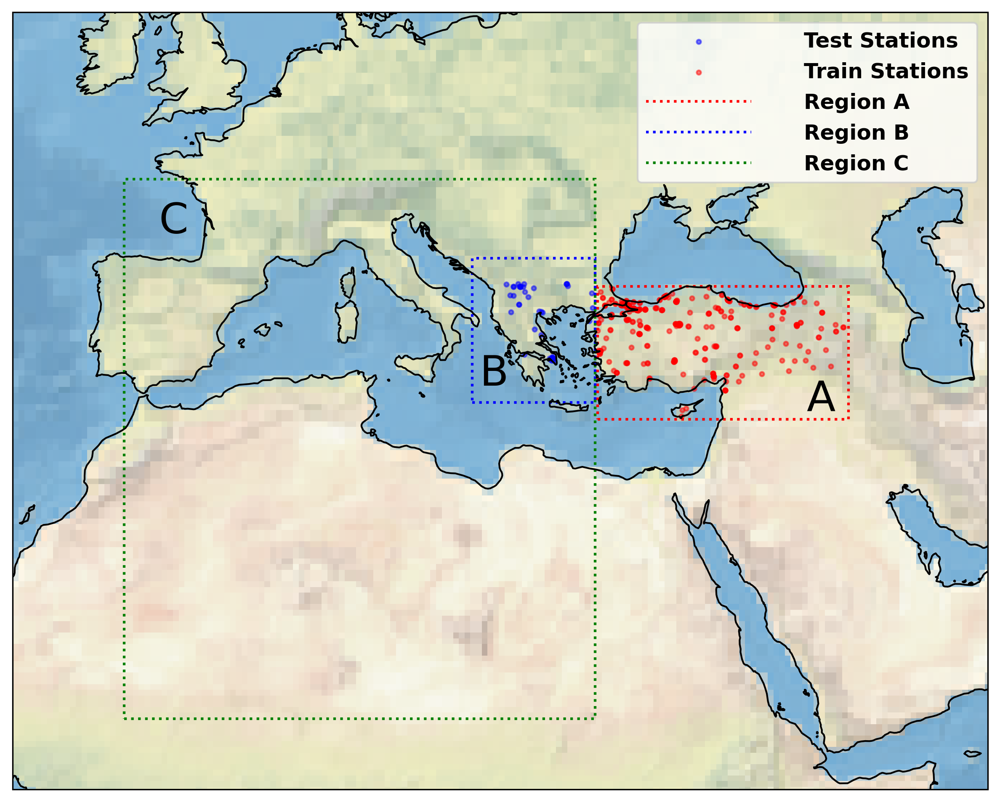
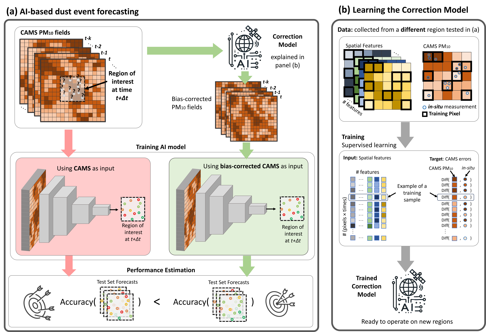
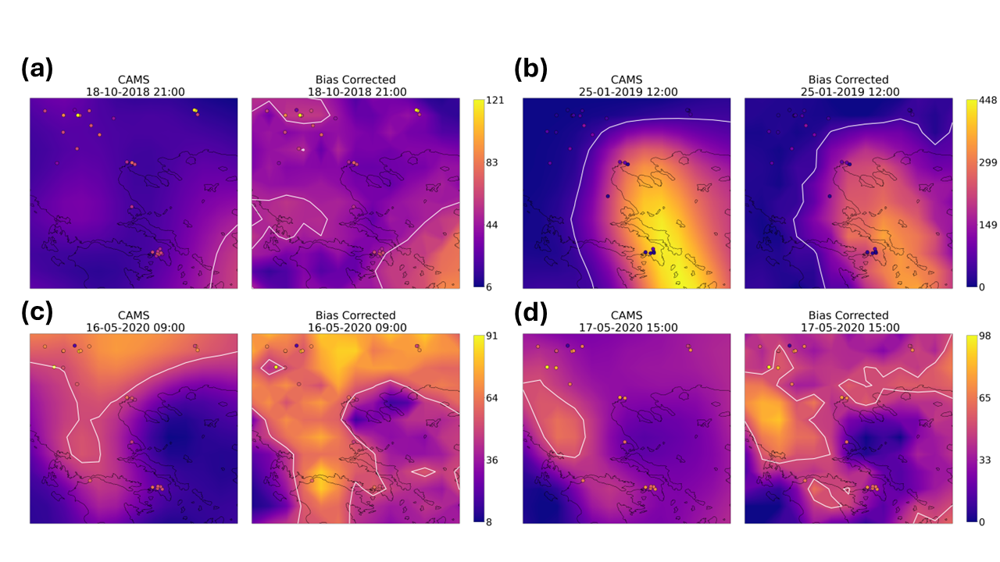

# Correction of CAMS PM10 Reanalysis Improves AI-Based Dust Event Forecasting

## Overview

This repository contains the code and data used in the study *"Correction of CAMS PM10 Reanalysis Improves AI-Based Dust Event Forecasting"*, which aims to improve the accuracy of dust event forecasts by correcting biases in the Copernicus Atmosphere Monitoring Service (CAMS) PM10 reanalysis. High dust loading impacts air quality, climate, and public health, and accurate, timely forecasts are crucial for mitigation. This study leverages machine learning to correct CAMS PM10 reanalysis errors, enhancing AI-based predictions of dust events across the Eastern Mediterranean.

## Authors
- **Ron Sarafian** - Earth and Planetary Science Department, Weizmann Institute of Science, Israel
- **Sagi Nathan** - Department of Statistics and Data Science, Hebrew University of Jerusalem, Israel
- **Dori Nissenbaum** - Weizmann Institute of Science, Israel
- **Yinon Rudich** - Earth and Planetary Science Department, Weizmann Institute of Science, Israel

For inquiries, please contact [ronsarafian@gmail.com](mailto:ronsarafian@gmail.com) or [yinon.rudich@weizmann.ac.il](mailto:yinon.rudich@weizmann.ac.il).

## Abstract

This study proposes a machine-learning approach to correct CAMS PM10 reanalysis data using in-situ PM10 measurements from Turkey. By training a correction model with meteorological, atmospheric, and satellite-derived data, we produce bias-corrected PM10 fields that significantly improve AI-based forecasting of dust events across the Balkans. Corrected PM10 fields enhance forecast performance for short (0-72 hours) lead times, increasing recall by approximately 7 percentage points and reducing CAMS reanalysis errors by substantial margins.

## Table of Contents

- [Introduction](#introduction)
- [Data](#data)
- [Methodology](#methodology)
- [Results](#results)
- [Usage](#usage)
- [Data Availability](#data-availability)
- [Citation](#citation)

## Introduction

Dust events are severe meteorological phenomena that impact climate and public health. Accurate, real-time forecasting of dust events is essential but remains challenging due to discrepancies in PM10 reanalysis data from sources like CAMS. CAMS often underestimates or overestimates PM10 concentrations, leading to unreliable dust event predictions. This study addresses these discrepancies by correcting CAMS PM10 reanalysis using a machine learning model that combines meteorological and atmospheric features.

## Data

The study relies on the following datasets:

1. **PM10 Ground Measurements**: In-situ PM10 data from 657 monitoring stations across Turkey and the Balkan Peninsula, covering 2013-2020.
2. **CAMS PM10 Reanalysis**: PM10 atmospheric composition from the EAC4 reanalysis dataset by CAMS, with a spatial resolution of 0.75° x 0.75°.
3. **Meteorological and Atmospheric Data**: ERA5 reanalysis data including variables like geopotential height, specific humidity, and temperature at various pressure levels.
4. **Satellite Data**: NDVI data from Sentinel-2, interpolated to match the CAMS PM10 spatial resolution.

The study involves multiple regions for training and testing the correction model. The image below shows the regions where the model was trained and tested:




## Methodology
The model flow is shown in the diagram below:


The workflow consists of two main stages:

### 1. Correction Model

The correction model, implemented with **Extreme Gradient Boosting (XGBoost)**, learns the discrepancy (error) between CAMS PM10 values and ground-truth measurements. It uses features from CAMS, ERA5, and NDVI datasets and outputs bias-corrected PM10 values.

### 2. Dust Forecasting Model

Using corrected PM10 fields as input, we train a deep Convolutional Neural Network (CNN) to forecast dust events up to 72 hours in advance. The network's performance on corrected PM10 data is compared to its performance on uncorrected data, showing improved forecast accuracy in terms of recall and F1 score.

### Evaluation

The forecasting model was evaluated with recall, F1 score, and balanced accuracy, with bias-corrected PM10 fields yielding significantly better results, particularly for short-term forecasts.

## Results

- **Correction Effectiveness**: The correction model reduced CAMS PM10 error by an average of 12 µg/m³ across unseen regions.
- **Forecast Improvement**: The dust forecast model, trained on corrected PM10 fields, achieved an 11 percentage-point improvement in 18-hour recall and 5 percentage points in F1 score for forecasts up to 48 hours.
- **Bias Insights**: CAMS PM10 biases were found to correlate with seasonal, regional, and environmental factors like NDVI, surface winds, and aerosol optical depth (AOD).
- 
The correction model significantly reduces PM10 error compared to uncorrected CAMS data. The following image compares model predictions with and without correction:





## Usage

To reproduce the results of this study, follow these steps:

1. **Clone this repository**:
   ```bash
   git clone https://github.com/yourusername/CAMS_bias_correction.git
   cd CAMS_bias_correction
   ```

2. **Install dependencies**:
   Ensure you have Python installed, then install the required packages:
   ```bash
   pip install -r requirements.txt
   ```

3. **Download and Prepare Data**:
   - Download PM10 in-situ data, CAMS reanalysis, ERA5 reanalysis, and NDVI datasets (see [Data Availability](#data-availability) for links).
   - Use the data preprocessing scripts provided in `scripts/preprocess_data.py` to align spatial and temporal resolutions as necessary.

4. **Run the Correction Model**:
   ```bash
   python scripts/run_correction_model.py
   ```

5. **Train the Dust Forecast Model**:
   ```bash
   python scripts/run_forecasting_model.py
   ```

6. **Evaluate the Models**:
   Use `scripts/evaluate.py` to compute metrics like recall, F1 score, and balanced accuracy.

## Data Availability

All data used in this study is publicly accessible:

- **TOAR Database** (PM10 measurements): [https://toar-data.org/](https://toar-data.org/)
- **CAMS Reanalysis**: [https://ads.atmosphere.copernicus.eu/cdsapp#!/dataset/cams-global-reanalysis-eac4](https://ads.atmosphere.copernicus.eu/cdsapp#!/dataset/cams-global-reanalysis-eac4)
- **ERA5 Reanalysis**: [https://cds.climate.copernicus.eu/cdsapp#!/dataset/reanalysis-era5-single-levels](https://cds.climate.copernicus.eu/cdsapp#!/dataset/reanalysis-era5-single-levels)
- **NDVI Data**: [https://lpdaac.usgs.gov/products/mod13a2v006/](https://lpdaac.usgs.gov/products/mod13a2v006/)

## Citation

If you find this repository helpful, please consider citing our paper:

```bibtex
@article{sarafian2024cams,
  title={Correction of CAMS PM10 Reanalysis Improves AI-Based Dust Event Forecast},
  author={Sarafian, Ron and Nathan, Sagi and Nissenbaum, Dori and Rudich, Yinon},
  journal={Journal of Atmospheric and Environmental Sciences},
  year={2024}
}
```

## License

This repository is licensed under the MIT License.

---

This README provides an overview of the correction and forecasting methodology, along with the resources needed to implement and evaluate the model. Contributions and feedback are welcome to enhance the accuracy of dust event forecasting.

